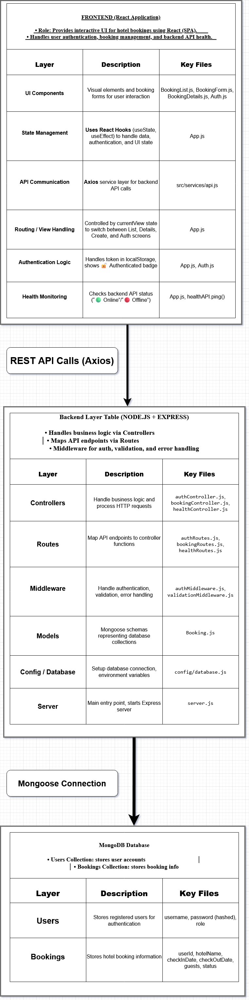

# Hotel Booker Fullstack Application
A modern full-stack web application for managing hotel bookings with a React frontend and Node.js/Express backend.


---

## 📋 Table of Contents
- [Overview](#-overview)
- [Features](#-features)
- [Tech Stack](#-tech-stack)
- [Project Structure](#-project-structure)
- [Installation](#-installation)
- [Configuration](#-configuration)
- [Running the Application](#-running-the-application)
- [System Architecture](#-system-architecture)
- [Testing Strategy](#-testing-strategy)
- [CI/CD Integration](#-cicd-integration)
- [Deployment](#-deployment)
- [Contributing](#-contributing)
- [License](#-license)
- [Support](#-support)
- [Acknowledgments](#-acknowledgments)

---

## 🏨 Overview

**Project Title:** Hotel Booker — MERN Stack Hotel Reservation System  
**Author:** Mohammed Ghanemi  

The Hotel Booker system is a full-stack web application that allows users to search, reserve, and manage hotel bookings online.  
It includes secure user authentication, dynamic booking management, admin control, and automated end-to-end testing.  

**QA Focus:** This project demonstrates advanced QA practices across **UI, API, functional, regression, integration, performance, and security testing**, using **Playwright**, **Postman**, and CI/CD automation.  

---

## ✨ Features

### Backend Features
- 🔐 JWT Authentication
- 📅 Booking CRUD Operations
- 🛡️ Input Validation
- 🏥 Health Check Endpoints
- 🔒 Security

### Frontend Features
- 📝 Interactive Booking Form
- 📋 Booking List & Management
- 🔍 Booking Details
- 👤 Login & Registration UI
- 📱 Mobile-Responsive Design
- 🔄 Real-time API Integration

---

## 🛠️ Tech Stack

### Backend
- Node.js & Express.js
- MongoDB with Mongoose
- JWT Authentication
- Joi Validation
- Security: bcrypt, helmet, cors

### Frontend
- React 18
- React Hooks
- Axios HTTP Client
- CSS3 Styling
- Create React App

## ✅ Testing Tools Used

I use **only one tool: Playwright**.  
Playwright is the core and only framework in my entire testing workflow.

---

### ✔ E2E Testing
Full end-to-end automation covering complete user flows from start to finish.

---

### ✔ UI Testing
Used Playwright for:
- Component validation  
- Form interactions  
- Visual checks  
- Navigation flows  
- DOM selector handling  

---

### ✔ API Testing
Performed API validation using Playwright’s built-in API features (`request` object) for:
- Sending requests  
- Validating responses  
- Testing backend logic without UI  

---

### ✔ Performance Testing
Used Playwright’s performance capabilities:
- Tracing  
- Page metrics  
- Network & response timing  
- Custom performance/load scripts  

---

### ✔ Accessibility Testing
Performed accessibility checks using:
- Playwright + Axe script integration  
**or**  
- Playwright’s built-in accessibility snapshot system  

---

### ✔ Security Testing
Implemented custom Playwright security tests for:
- Authentication  
- Authorization  
- Forbidden route access  
- Input sanitization  
- XSS attempts  
- CSRF-related behavior  
---

## 🚀 Installation

### Prerequisites
- Node.js (v18+)
- MongoDB (v6+)
- npm

### System Architecture Diagram 



[Download Full Architecture PDF](docs/Booking-Fullstackapp.pdf)

1. Clone the repository:  
```bash
git clone https://github.com/mohammedghanemi/Hotel-Booker-Fullstack-Application-Tested-with-Playwright-Postman.git
cd backend
npm install
cd frontend
npm install
npm install -D @playwright/test
npx playwright install
```
2. Running the Application:  
```bash
cd frontend
npm start
cd backend 
npm run dev
npx playwright test
```

## 🧪 Testing Strategy

### 1️⃣ Functional Testing
Verify that each feature works as expected:
- Login & registration
- Booking creation, editing, deletion
- Admin approval  

**Tool:** Playwright E2E tests

---

### 2️⃣ UI Testing
- Cross-browser testing: Chrome, Firefox, Safari
- Responsive testing: Mobile, tablet, desktop
- Visual regression: screenshot comparison  

**Tool:** Playwright with screenshot assertions

---

### 3️⃣ API Testing
- Test CRUD operations and authentication endpoints
- Validate response codes (200, 201, 400, 401, 500)
- Schema validation  

**Tools:** Postman / Newman or Playwright API testing

---

### 4️⃣ Regression Testing
- Re-run automated test suite on every release
- Ensure existing functionality remains intact  

**Tools:** Playwright + CI/CD

---

### 5️⃣ Integration Testing
- Test interaction between frontend & backend
- Test database integration
- Validate full API + UI flow  

**Tool:** Playwright E2E with real API endpoints

---

### 6️⃣ Performance Testing
- Load testing backend endpoints
- Measure response times and throughput  

**Tools:** k6 or Artillery

---

### 7️⃣ Security Testing
- Test authentication & authorization
- Detect vulnerabilities (XSS, SQLi, JWT attacks)
- Use automated security scanners  

**Tools:** OWASP ZAP, Snyk, manual security checks

---

### 8️⃣ Accessibility Testing
- Validate that all pages are keyboard navigable
- Ensure form labels and ARIA attributes exist  

**Tools:** axe-core, Lighthouse

---

### 9️⃣ Reporting
- Generate HTML/JSON test reports
- Include screenshots of failed tests
- Track test coverage and CI/CD status badges

---

### ✅ Key Benefits for Job Applications
1. **Demonstrates full-spectrum QA skills:** functional, UI, API, regression, integration, performance, security, accessibility.  
2. **Showcases modern QA tools:** Playwright, Postman, k6, axe-core, OWASP ZAP.  
3. **CI/CD automation:** highlights professional QA pipeline knowledge.  
4. **Visual reports & badges:** improves GitHub portfolio presentation.  
5. **Strong theory + practice:** explains what is tested and shows practical implementation.
